# App Center Hands On with Xamarin

2017/12/14 [@ytabuchi](https://twitter.com/ytabuchi) Created.


## 事前準備


### GitHub アカウントの準備

このハンズオンでは、GitHub の連携を使用して App Center の Build や Analytics を体験します。そのため、GitHub のアカウントが必要です。

まだ GitHub のアカウントを持っていない方は [github.com](https://github.com/) からアカウントを作成してください。


#### レポジトリの作成

アカウントを作成したらレポジトリを作成します。

自分のページにアクセスし、「Repositories」タブをクリックして、「New」ボタンからレポジトリを作成します。

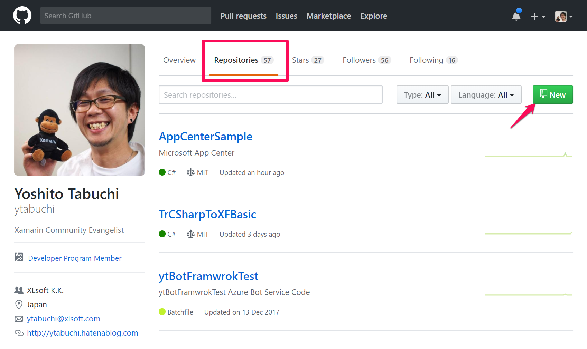

任意の名前でレポジトリを作成し、「Add .gitignore」を「Visual Studio」などに指定して「Create repository」をクリックして作成します。

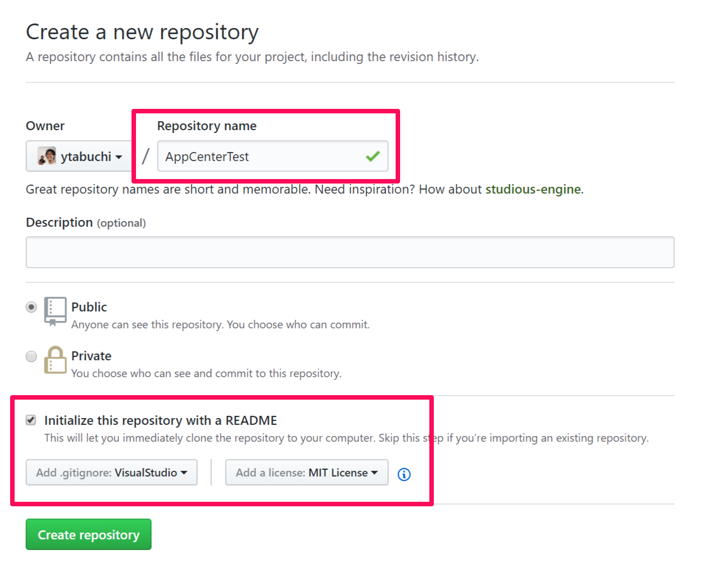

#### .gitignore の設定


作成されたレポジトリの `.gitignore` ファイルを開き、[Xamarin 用の設定（現時点ではこの `.gitignore` ファイルがお勧めです。）](https://github.com/ytabuchi/GitIgnoreTest/blob/master/.gitignore) に修正します。「Edit アイコン」をクリックすることで、そのままサイト上でも編集できます。

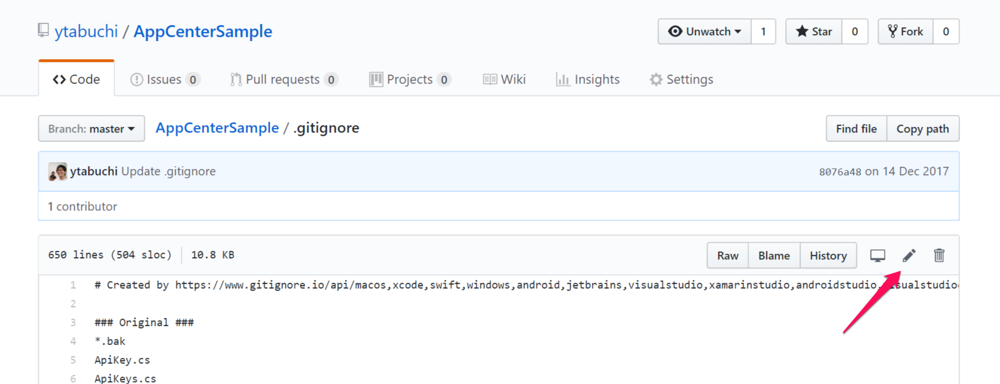

GitHub の準備が完了したのでローカルに Clone します。

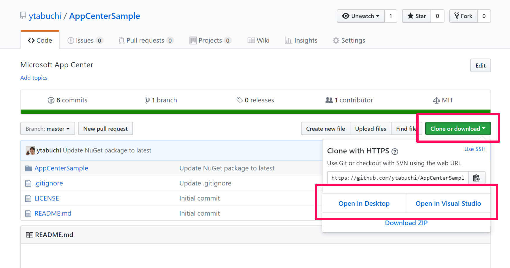

ローカルのクライアントは何でも構いません。以下などがあります。

- [GitHub Desktop](https://desktop.github.com/)
- [Sourcetree](https://ja.atlassian.com/software/sourcetree)

Visual Studio の拡張機能もあります。

- [GitHub Extension for Visual Studio](https://visualstudio.github.com/)

ここではクライアントの使い方は割愛します。興味がある方は是非調べてみてください。


### App Center アカウントの準備

次に App Center のアカウントを作成します。[appcenter.ms](https://appcenter.ms) にアクセスします。

右上の「GET STARTED」をクリックして次に進みます。

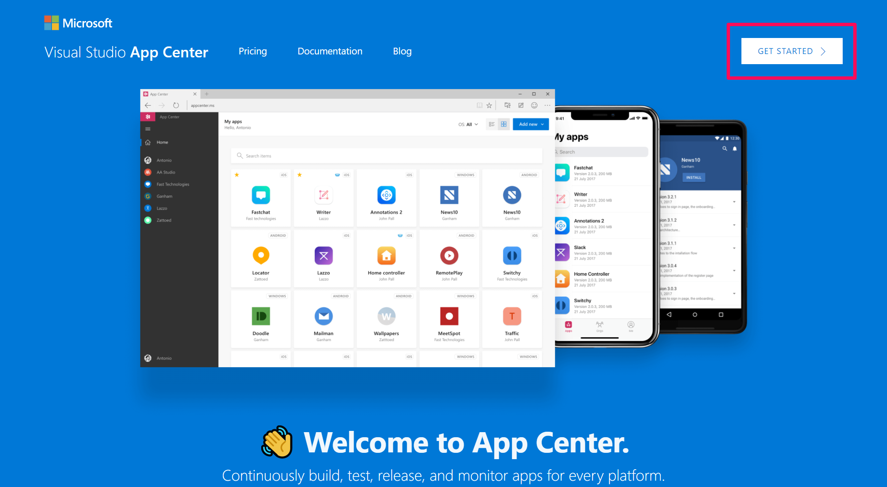

App Center には、次の方法でアクセスが出来ます。

- GitHub アカウント
- Microsoft アカウント
- facebook アカウント
- Google アカウント
- App Center のアカウント

ここでは、GitHub のアカウントでログインしてみましょう。


「Authorize VSAppCenter」をクリックして App Center を Authorize します。

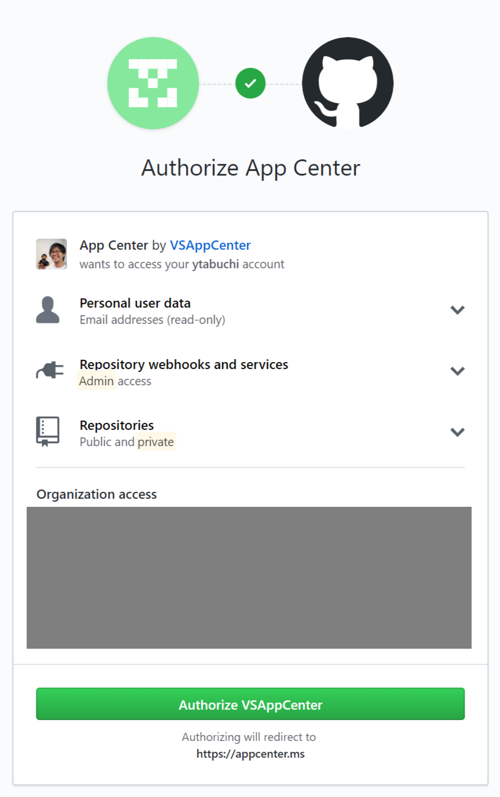

Microsoft アカウントでログインする場合は、アカウントを選択してログインします。複数のアカウントを持っている場合は次のような画面になります。

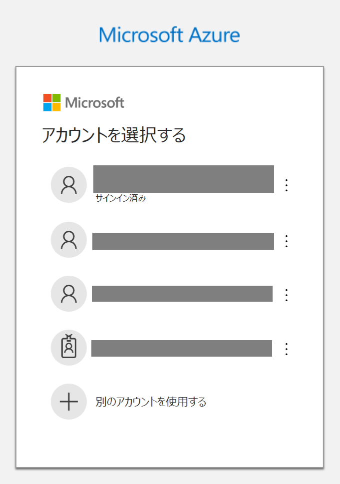


次のような画面が表示されればログインは完了です。

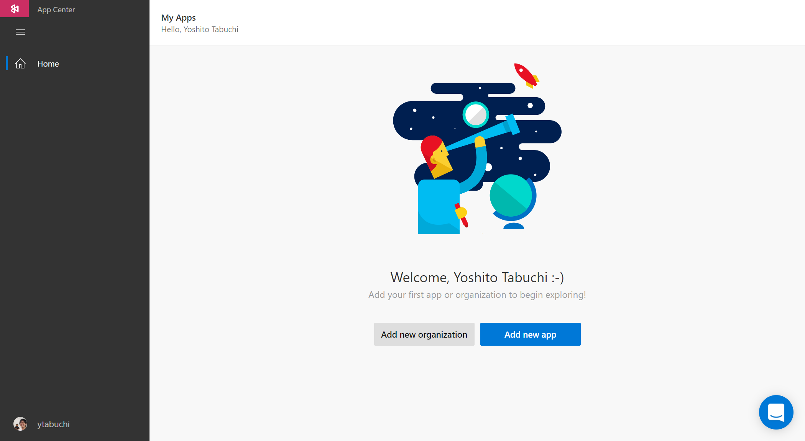

事前準備はこれで終了です。


## App Center にアプリ追加

そのまま App Center にアプリを追加していきます。「Add New App」をクリックして、まずは Android アプリを追加します。


「Name」に「AppCenterSampleAndroid」と入力し、「Android」と「Xamarin」を選択して「App new app」をクリックします。

アプリが作成されました。下の方にスクロールすると Xamarin 用、Xamarin.Forms 用のドキュメントが参照できます。

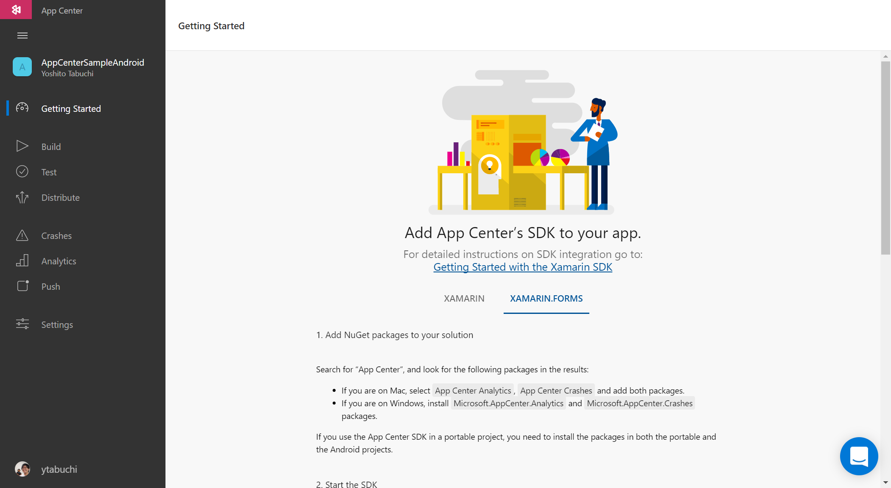

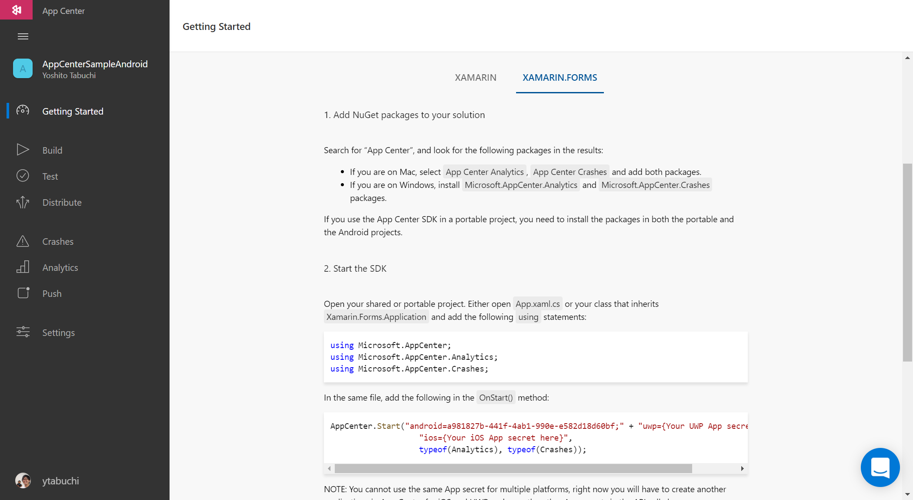

左上のアイコンでホーム画面に戻り、同様に「Add new＞Add new app」から iOS アプリ「AppCenterSampleiOS」と UWP アプリ「AppCenterSampleUWP」を作成します。

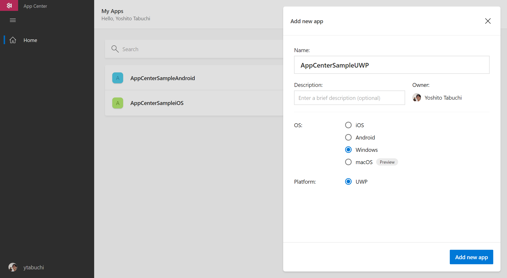


Android アプリ「AppCenterSampleAndroid」を開き、「Settings」をクリックすると、右上に App Secret が確認できます。この Secret は後で使用しますので、Android、iOS、UWP の Secret を控えておいてください。

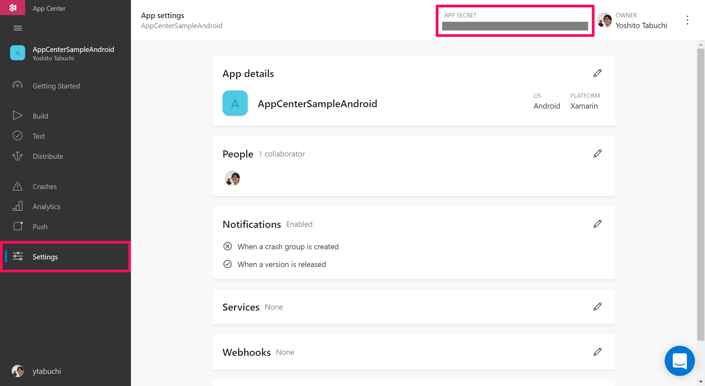


## Visual Studio プロジェクトの準備

それでは実際に App Center で使用するプロジェクトを作成します。このドキュメントでは Windows の Visual Studio での画面を掲載しています。Mac の Visual Studio for Mac を使用している方は適宜読み替えてください。

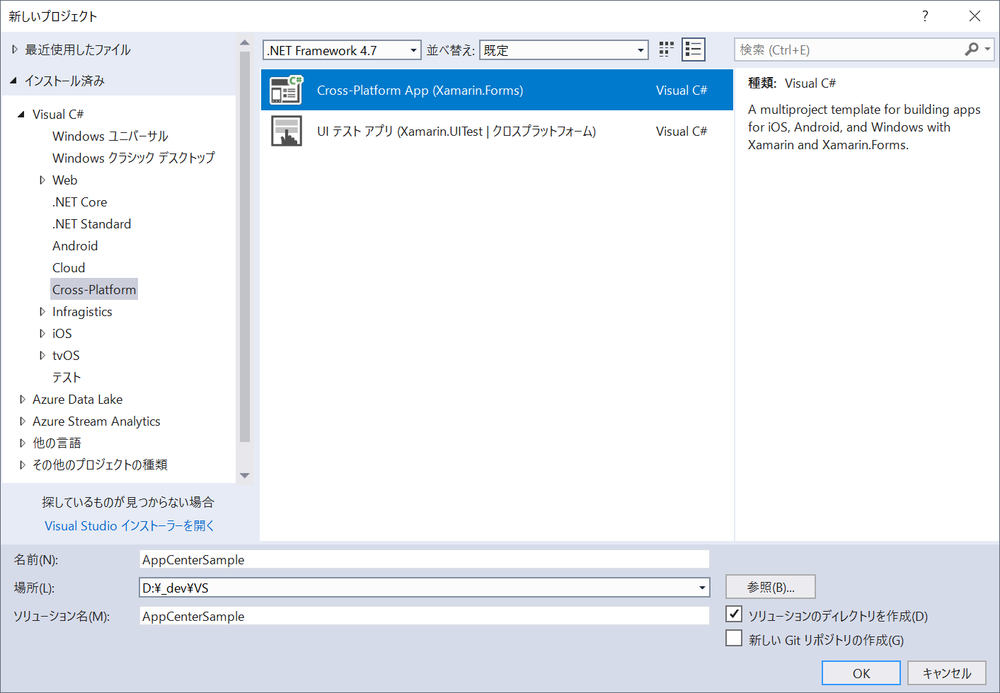

Visual Studio を開き、「新しいプロジェクトの作成」から、「Visual C#＞Cross-Platform＞Corsss-Platform App (Xamarin.Forms)」を選択します。今回はプロジェクトの名前を「AppCenterSample」としました。

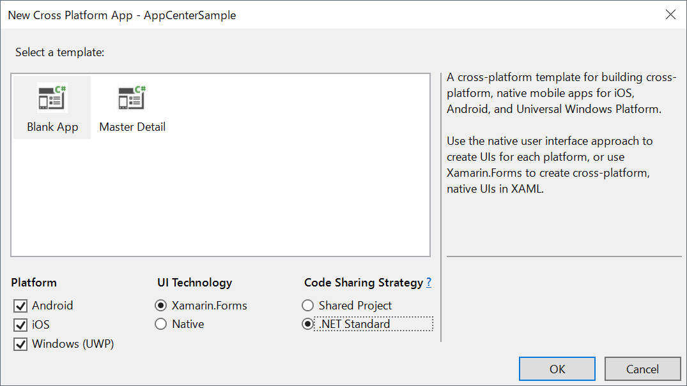

「Platform」をすべてチェック、「UI Technology」を「Xamarin.Forms」、「Code Sharing Strategy」を「.NET Standard」にして「OK」をクリックします。

プロジェクトが作成されたら使用しているライブラリを最新にしておきましょう。

ソリューションを右クリックして、「ソリューションの NuGet パッケージの管理」から NuGet パッケージマネージャーを開き、「更新」タブの「すべて更新」をチェックし、「更新」ボタンをクリックします。


そのまま以下の NuGet パッケージをインストールします。

- `Microsoft.AppCenter.Analytics`（macOS の場合は `App Center Analytics`）
- `Microsoft.AppCenter.Crashes`（macOS の場合は `App Center Crashes`）

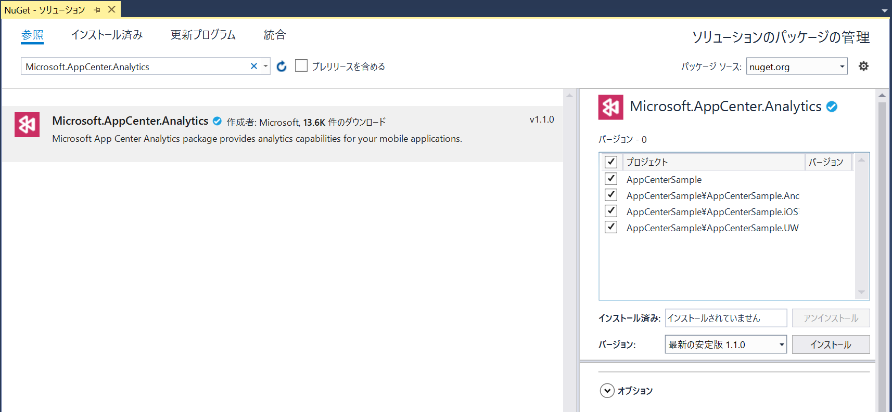

PCL／.NET Standard を使用している場合は、すべてのプロジェクトにインストールすることに注意してください。


インストールが完了すると、次のようなプロジェクト構成になっているはずです。

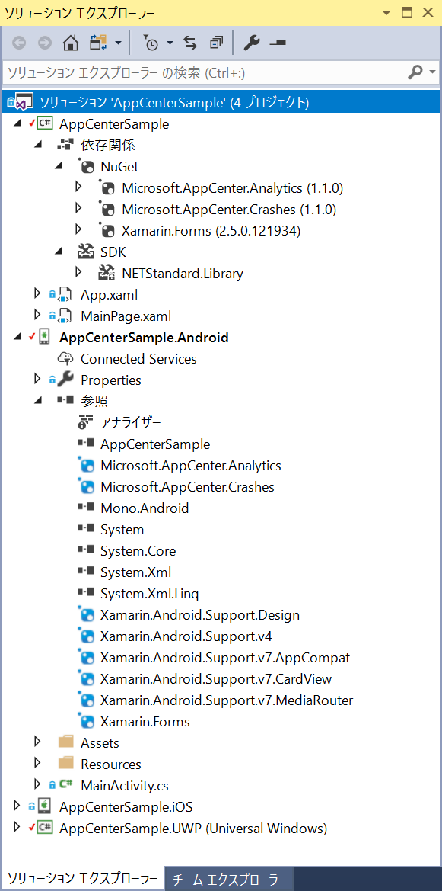

次に Xamarin.Forms プロジェクトの `App.xaml.cs` を開き、以下の using を追加します。

```cs
using Microsoft.AppCenter;
using Microsoft.AppCenter.Analytics;
using Microsoft.AppCenter.Crashes;
```

同じファイルの `OnStart()` メソッド内に次のコードを追加します。

```cs
if (Xamarin.Forms.Device.RuntimePlatform == Xamarin.Forms.Device.UWP)
    AppCenter.Start("uwp={Your UWP App secret here};", 
        typeof(Analytics));
else
    AppCenter.Start("android={Your Android App secret here};" + "ios={Your iOS App secret here}",
        typeof(Analytics), typeof(Crashes));
```

> Secret は各プラットフォーム毎に発行されます。「App Center にアプリ追加」の章で作成した各プラットフォームの App Secret で上記の {Your xxx App secret here} を置き換えてください。

それでは、Android アプリをビルドして起動してみましょう。

> java.lang.OutOfMemoryError. Consider increasing the value of $(JavaMaximumHeapSize). Java ran out of memory while executing 'java.exe ...<br />
と、Android プロジェクトでヒープメモリのビルドエラーが出る場合、Android プロジェクトのプロパティを開き、「Android オプション＞詳細設定（一番下にあるボタン）＞Java Max Heap Size」を「1G」に指定してください。<br />
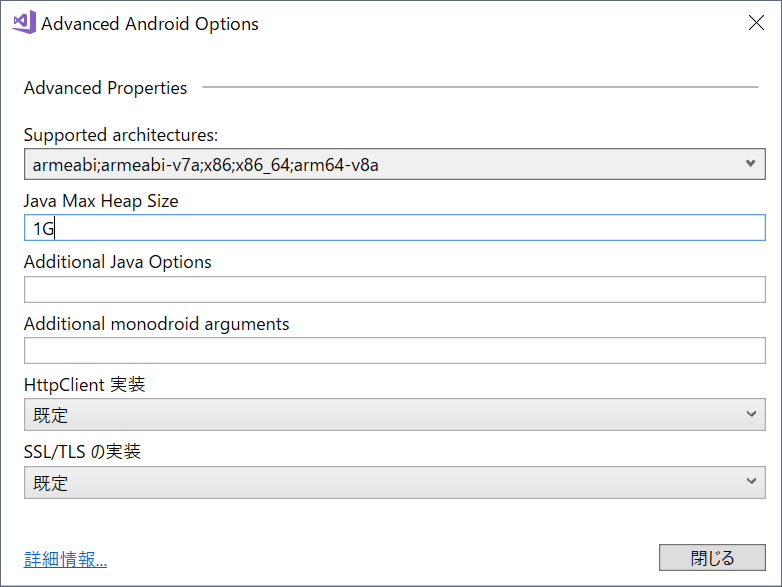


この時点で、OS 情報などの Analytics が取得出来ていることが確認できます。

App Center でビルドしたアプリ（今回は Android）の「Analytics」を開いてみましょう。Emulator で言語設定が英語になっているのが分かります。

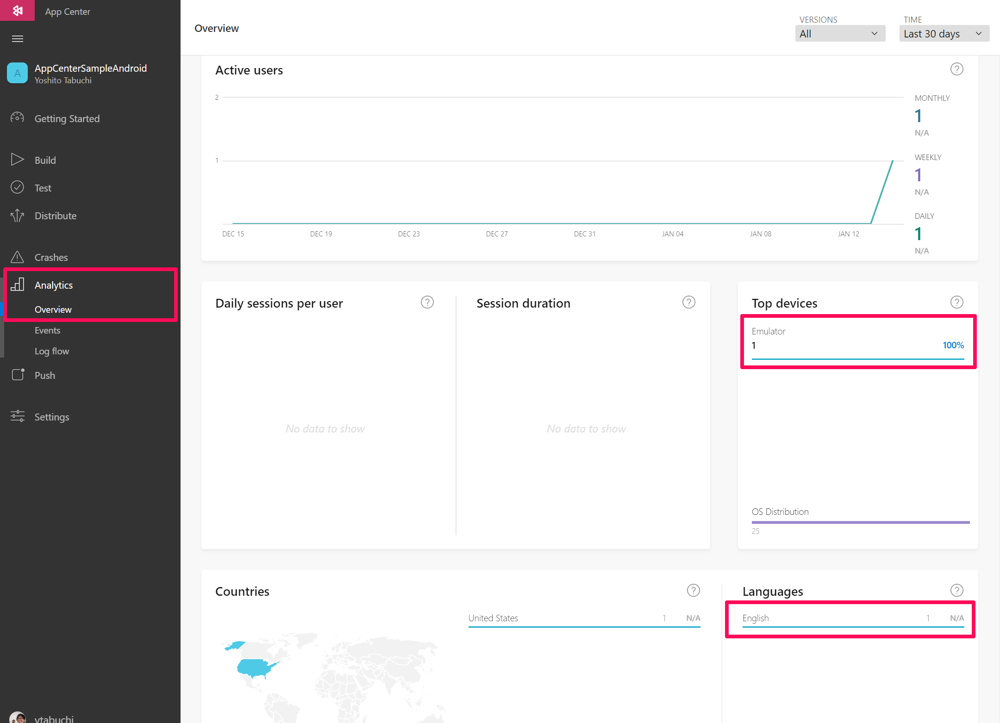


## App Center の各種機能を使う

ローカルでソリューションがビルド出来たところで、実際に App Center で色々出来るようにしていきましょう。


### Build

左側のメニューから「Build」を開きます。

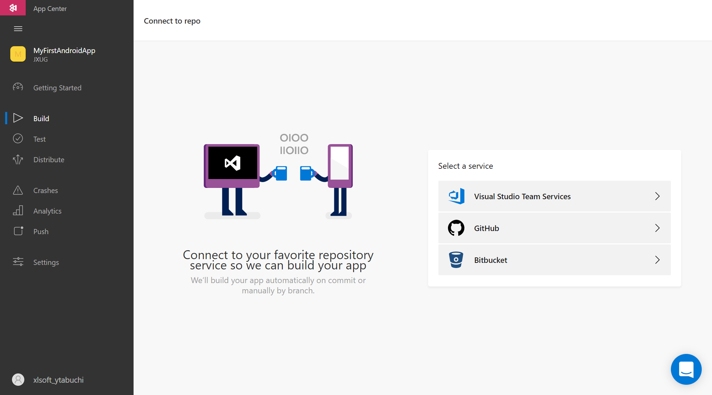

GitHub や VSTS（Visual Studio Team Service）、BitBucket のレポジトリに変更があれば自動ビルドを行う仕組みです。

今回は、GitHub のレポジトリを指定してみましょう。GitHub をクリックすると、次のような認証画面に移行します。そのまま「Authrize VSAppCenter」をクリックしてください。


自身のレポジトリ一覧が表示されるので、最初に作成したレポジトリを指定します。

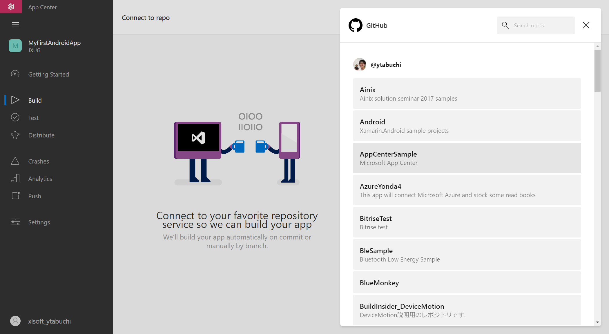

ブランチをクリックして、「Configure build」をクリックします。


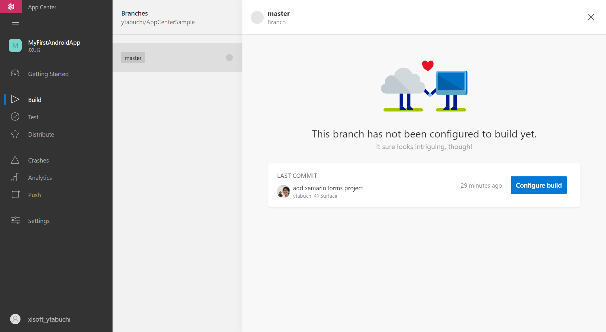

まずはそのままの設定で「Save & Build」ボタンをクリックしてビルドしてみましょう。「Build this branch on every push」が選択されているので、Master ブランチにプッシュされる度に自動的にビルドが開始されます。

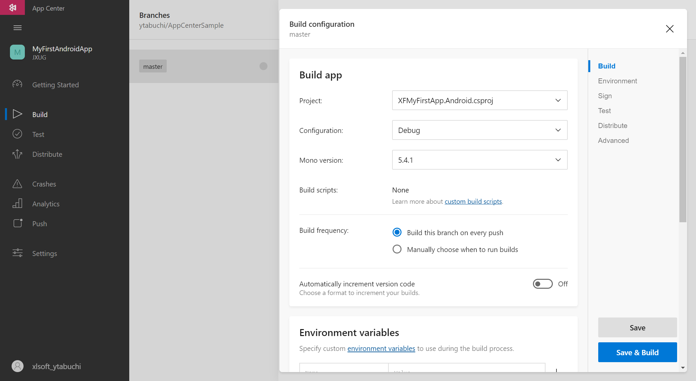

ビルドが無事完了しました！

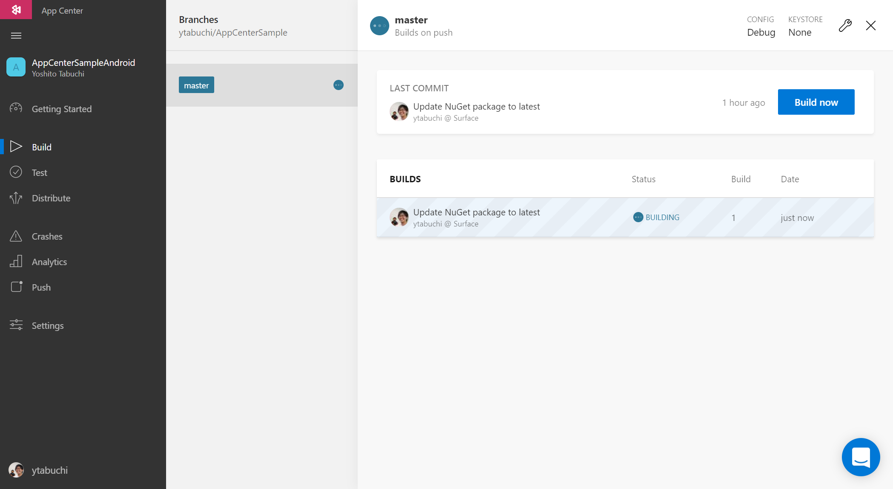

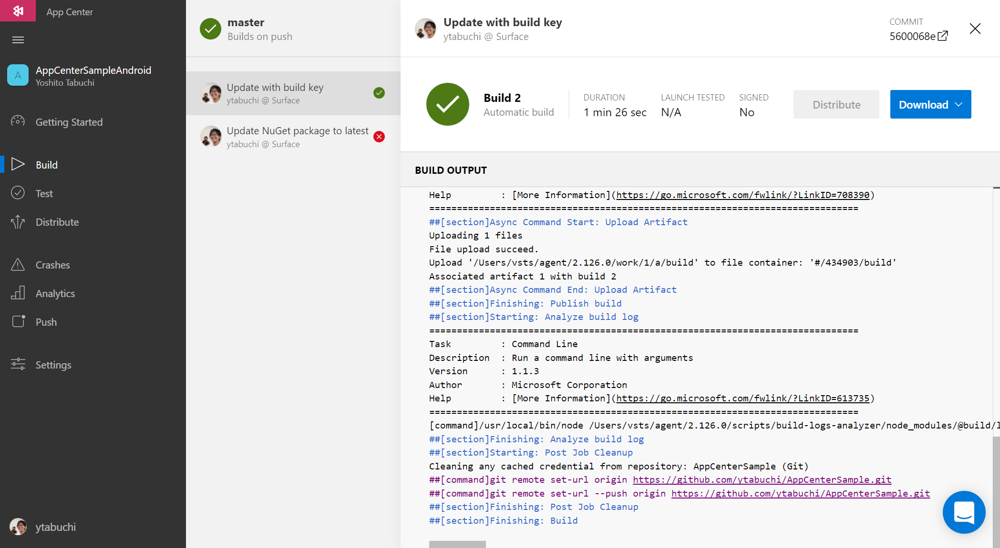


GitHub の設定の [Authorized OAuth Apps](https://github.com/settings/applications) に App Center が追加されていることが確認できます。


Windows

`%LOCALAPPDATA%\Xamarin\Mono for Android\debug.keystore`

macOS

`~/.local/share/Xamarin/Mono for Android/debug.keystore`

[Finding your Keystore's MD5 or SHA1 Signature \- Xamarin](https://developer.xamarin.com/guides/android/deployment,_testing,_and_metrics/MD5_SHA1/)


### Test

xxx


### Distribute

xxx


### Crashes

xxx


### Analytics

xxx


### Push

xxx


## まとめ

